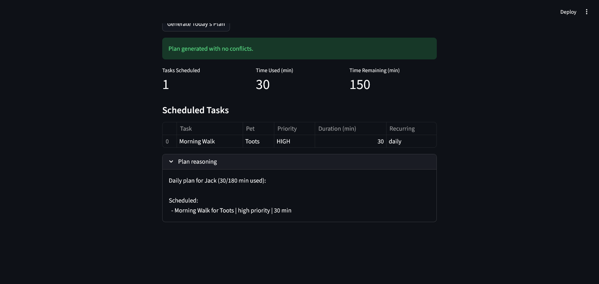

# PawPal+

PawPal+ is a Streamlit app that helps pet owners plan daily care tasks for their pets.
It schedules tasks based on priority and available time, supports recurring tasks, and
explains what was scheduled and what was skipped.

## Features

- **Priority-based scheduling** — tasks are scheduled HIGH before MEDIUM before LOW
- **Duration tiebreaking** — within the same priority tier, shorter tasks are scheduled first to fit the most into the available budget
- **Recurring tasks** — tasks can be marked `daily` (always included) or `weekly` (included only when 7+ days have passed since last scheduled), using `is_due()` logic
- **Task filtering** — filter the task list by pet name, completion status, or both via `filter_tasks()`
- **Conflict detection** — `validate()` flags duplicate tasks and warns when total task time exceeds the owner's daily budget, before the plan runs
- **Plan reasoning** — `explain_plan()` lists every scheduled task with its priority and duration, and reports which tasks were skipped and why

## Setup

```bash
python -m venv .venv
source .venv/bin/activate  # Windows: .venv\Scripts\activate
pip install -r requirements.txt
```

Run the app:

```bash
streamlit run app.py
```

## Smarter Scheduling

The scheduler goes beyond a simple priority queue:

- **Priority + duration sorting** — tasks are sorted by priority first (HIGH before MEDIUM before LOW), then by shortest duration within the same priority tier, so the most important and most efficient tasks fill the budget first.
- **Recurring tasks** — each task can be marked `"daily"` (always included) or `"weekly"` (included only if 7 or more days have passed since it was last scheduled). Non-recurring tasks are always considered.
- **Task filtering** — `filter_tasks()` returns a subset of the task list by pet name, completion status, or both, without modifying the original list.
- **Conflict detection** — `validate()` checks for duplicate tasks (same name and pet) and flags if the total task time exceeds the owner's daily budget, before scheduling runs.

## Testing PawPal+

```bash
python -m pytest tests/test_pawpal.py -v
```

9 tests cover: time budget validation, priority ordering, duration tiebreaking within the same priority tier, pet with no tasks, budget overflow handling, weekly recurrence exclusion, duplicate conflict detection, task completion, and task addition to a pet.

```
Confidence Level: ⭐⭐⭐⭐ (4/5)
The core scheduling logic is well tested. Edge cases around recurrence
and conflict detection are covered. Untested areas: multi-day planning,
preference-based filtering, and UI interaction flows.
```

## Demo

<a href="Images/demo.png" target="_blank">
  
</a>
